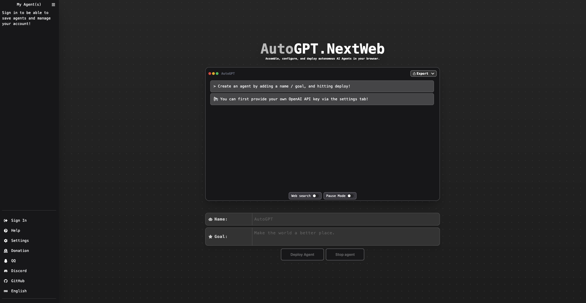

<div align="center">

<h1 align="center">AutoGPT-Next-Web</h1>

English / [简体中文](https://github.com/Dogtiti/AutoGPT-Next-Web/blob/main/docs/README_CN.md) / [日本語](https://github.com/Dogtiti/AutoGPT-Next-Web/blob/main/docs/README_JA.md)

One-Click to deploy well-designed AutoGPT-Next-Web web UI on Vercel.

一键免费部署你的私人 AutoGPT-Next-Web 网页应用。

[Demo](https://auto-agentgpt.com/) / [Issues](https://github.com/Dogtiti/AutoGPT-Next-Web/issues) / [Join Discord](https://discord.gg/Xnsbhg6Uvd) / [Buy Me a Coffee](https://www.buymeacoffee.com/elricliu)

[演示](https://auto-agentgpt.com/) / [反馈](https://github.com/Dogtiti/AutoGPT-Next-Web/issues) / [QQ群](https://github.com/Dogtiti/AutoGPT-Next-Web/assets/38354472/562fabbb-76cd-4902-bb07-9ec7d82871fc
) / [微信](https://user-images.githubusercontent.com/38354472/232797309-9348f3a6-1dd7-422a-ad01-935247b1970e.png) / [打赏开发者](https://user-images.githubusercontent.com/38354472/232796654-c749602b-c1d4-402b-8c31-e7c013b7a42d.png)

[](https://vercel.com/new/clone?repository-url=https%3A%2F%2Fgithub.com%2FDogtiti%2FAutoGPT-Next-Web&env=OPENAI_API_KEY&project-name=autogpt-next-web&repository-name=AutoGPT-Next-Web)



</div>

## Discuss with us


## Features

1. Free one-click deployment with Vercel in 1 minute
2. Improved local support: After typing in Chinese, the content will be displayed in Chinese instead of English
3. UI designed to match AgentGPT, responsive design, and support for dark mode
4. Have your own domain? Even better, after binding, you can quickly access it anywhere without barriers
5. Support access code control, only you or trusted individuals can use the website

## Roadmap

- [x] 1. Add support for Docker and Docker Compose
- [x] 2. Add support for Endpoint URL
- [x] 3. Add support for Azure OpenAI API
- [ ] 4. Optimize the display of running results for easier viewing
- [ ] 5. Add support for WeChat login

## Business Version

During the period of maintaining open source projects, many friends came to consult about customizing the system. Considering that there may be more friends who have similar needs, we decided to start the internal test plan of the commercial version~

- plan support -
  User login system, billing system, charging system, etc., so that everyone can directly deploy a charged version of AutoGPT, and can directly obtain income
- way of participation -
  To pre-order the commercial version and view the details of the commercial version plan, please click the link below [AutoGPT-Next-Web Business Vision](https://egqz2y6eul.feishu.cn/docx/PxoMd7LGfoobAixiuWacxRWQnNd)

## Get Started

[Click me to view the detailed tutorial](https://autogpt-next-web.gitbook.io/autogpt-next-web/)

1. Prepare the OpenAI API Key;
2. Click the deploy button and follow the prompts
3. We support access control capabilities, see the tutorial above for a detailed tutorial

## FAQ

Q: What is the difference between this project and AgentGPT?

A: The project originated from AgentGPT. Our goal is to continuously provide user-friendly features, interfaces, and various deployment solutions for domestic users, helping everyone to easily build their own "AutoGPT" website. And the i18n ability and Vercel deployment ability in the AgentGPT project also come from our contributions.

## Docker Deployment

### Docker Local Setup

The easiest way to run AutoGPT-Next-Web locally is by using docker.

```bash
 docker-compose -f docker-compose.dev.yml up -d --remove-orphans
```

### Docker-Image

Using `docker-image`

```bash
docker-compose  -f docker-compose.prod.yml up -d --remove-orphans
```

### Local Development Setup

If you wish to develop AutoGPT-Next-Web locally, the easiest way is to
use the provided setup script.

```bash
./setup.sh
```

### Manual Setup

> You will need [Nodejs +18 (LTS recommended)](https://nodejs.org/en/) installed.

1. Fork this project:

- [Click here](https://github.com/Dogtiti/AutoGPT-Next-Web/fork).

2. Clone the repository:

```bash
git clone git@github.com:YOU_USER/AutoGPT-Next-Web.git
```

3. Install dependencies:

```bash
cd AutoGPT-Next-Web
npm install
```

4. Create a **.env** file with the following content:

> The environment variables must match the following [schema](https://github.com/Dogtiti/AutoGPT-Next-Web/blob/main/src/env/schema.mjs).

```bash
# Deployment Environment:
NODE_ENV=development

# Next Auth config:
# Generate a secret with `openssl rand -base64 32` or visit https://generate-secret.vercel.app/
NEXTAUTH_SECRET=''
NEXTAUTH_URL=http://localhost:3000
DATABASE_URL=file:./db.sqlite
NEXT_PUBLIC_WEB_SEARCH_ENABLED='' #true or false
SERP_API_KEY=''
# Your open api key
OPENAI_API_KEY=''
```

5. Modify prisma schema to use sqlite:

```bash
./prisma/useSqlite.sh
```

**Note:** This only needs to be done if you wish to use sqlite.

6. Ready, now run:

```bash
# Create database migrations
npx prisma db push
npm run dev
```


## Connect-AI More
| <div style="width:200px">AI</div> |              SDK               |                         Application                          |
| :-------------------------------: | :----------------------------------------------------------: | :----------------------------------------------------------: |
|              🎒OpenAI              |    [Go-OpenAI](https://github.com/ConnectAI-E/Go-OpenAI)     | [🏅Feishu-OpenAI](https://github.com/ConnectAI-E/Feishu-OpenAI), [🎖Lark-OpenAI](https://github.com/ConnectAI-E/Lark-OpenAI), [Feishu-EX-ChatGPT](https://github.com/ConnectAI-E/Feishu-EX-ChatGPT), [🎖Feishu-OpenAI-Stream-Chatbot](https://github.com/ConnectAI-E/Feishu-OpenAI-Stream-Chatbot), [Feishu-TLDR](https://github.com/ConnectAI-E/Feishu-TLDR),[Feishu-OpenAI-Amazing](https://github.com/ConnectAI-E/Feishu-OpenAI-Amazing), [Feishu-Oral-Friend](https://github.com/ConnectAI-E/Feishu-Oral-Friend), [Feishu-OpenAI-Base-Helper](https://github.com/ConnectAI-E/Feishu-OpenAI-Base-Helper), [Feishu-Vector-Knowledge-Management](https://github.com/ConnectAI-E/Feishu-Vector-Knowledge-Management), [Feishu-OpenAI-PDF-Helper](https://github.com/ConnectAI-E/Feishu-OpenAI-PDF-Helper), [🏅Dingtalk-OpenAI](https://github.com/ConnectAI-E/Dingtalk-OpenAI), [Wework-OpenAI](https://github.com/ConnectAI-E/Wework-OpenAI), [WeWork-OpenAI-Node](https://github.com/ConnectAI-E/WeWork-OpenAI-Node), [llmplugin](https://github.com/ConnectAI-E/llmplugin) |
|             🤖 AutoGPT             |                            ------                            | [🏅AutoGPT-Next-Web](https://github.com/ConnectAI-E/AutoGPT-Next-Web) |
|         🎭 Stablediffusion         |                            ------                            | [🎖Feishu-Stablediffusion](https://github.com/ConnectAI-E/Feishu-Stablediffusion) |
|           🍎 Midjourney            | [Go-Midjourney](https://github.com/ConnectAI-E/Go-Midjourney) | [🏅Feishu-Midjourney](https://github.com/ConnectAI-E/Feishu-Midjourney), [🔥MidJourney-Web](https://github.com/ConnectAI-E/MidJourney-Web), [Dingtalk-Midjourney](https://github.com/ConnectAI-E/Dingtalk-Midjourney) |
|            🍍 文心一言             |    [Go-Wenxin](https://github.com/ConnectAI-E/Go-Wenxin)     | [Feishu-Wenxin](https://github.com/ConnectAI-E/Feishu-Wenxin), [Dingtalk-Wenxin](https://github.com/ConnectAI-E/Dingtalk-Wenxin), [Wework-Wenxin](https://github.com/ConnectAI-E/Wework-Wenxin) |
|             💸 Minimax             |   [Go-Minimax](https://github.com/ConnectAI-E/Go-Minimax)    | [Feishu-Minimax](https://github.com/ConnectAI-E/Feishu-Minimax), [Dingtalk-Minimax](https://github.com/ConnectAI-E/Dingtalk-Minimax), [Wework-Minimax](https://github.com/ConnectAI-E/Wework-Minimax) |
|             ⛳️ CLAUDE              |    [Go-Claude](https://github.com/ConnectAI-E/Go-Claude)     | [Feishu-Claude](https://github.com/ConnectAI-E/Feishu-Claude), [DingTalk-Claude](https://github.com/ConnectAI-E/DingTalk-Claude), [Wework-Claude](https://github.com/ConnectAI-E/Wework-Claude) |
|              🥁 PaLM               |      [Go-PaLM](https://github.com/ConnectAI-E/go-PaLM)       | [Feishu-PaLM](https://github.com/ConnectAI-E/Feishu-PaLM),[DingTalk-PaLM](https://github.com/ConnectAI-E/DingTalk-PaLM),[Wework-PaLM](https://github.com/ConnectAI-E/Wework-PaLM) |
|             🎡 Prompt              |                            ------                            | [📖 Prompt-Engineering-Tutior](https://github.com/ConnectAI-E/Prompt-Engineering-Tutior) |
|             🍋 ChatGLM             |                            ------                            | [Feishu-ChatGLM](https://github.com/ConnectAI-E/Feishu-ChatGLM) |
|            ⛓ LangChain            |                            ------                            | [📖 LangChain-Tutior](https://github.com/ConnectAI-E/LangChain-Tutior) |
|            🪄 One-click            |                            ------                            | [🎖Awesome-One-Click-Deployment](https://github.com/ConnectAI-E/Awesome-One-Click-Deployment) |


