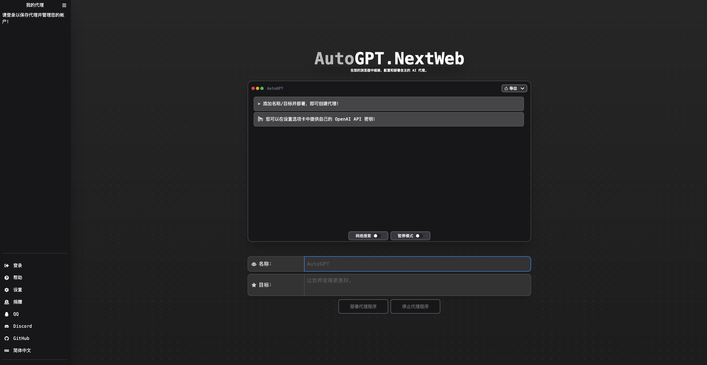

<div align="center">

<h1 align="center">AutoGPT-Next-Web</h1>

[English](https://github.com/Dogtiti/AutoGPT-Next-Web/blob/main/README.md) / 简体中文 / [日本語](https://github.com/Dogtiti/AutoGPT-Next-Web/blob/main/docs/README_JA.md)

One-Click to deploy well-designed AutoGPT-Next-Web web UI on Vercel.

一键免费部署你的私人 AutoGPT-Next-Web 网页应用。

[Demo](https://auto-agentgpt.com) / [Issues](https://github.com/Dogtiti/AutoGPT-Next-Web/issues) / [Join Discord](https://discord.gg/Xnsbhg6Uvd) / [Buy Me a Coffee](https://www.buymeacoffee.com/elricliu)

[演示](https://auto-agentgpt.com/) / [反馈](https://github.com/Dogtiti/AutoGPT-Next-Web/issues) / [QQ群](https://github.com/Dogtiti/AutoGPT-Next-Web/assets/38354472/562fabbb-76cd-4902-bb07-9ec7d82871fc
) / [微信](https://user-images.githubusercontent.com/38354472/232797309-9348f3a6-1dd7-422a-ad01-935247b1970e.png) / [打赏开发者](https://user-images.githubusercontent.com/38354472/232796654-c749602b-c1d4-402b-8c31-e7c013b7a42d.png)

[](https://vercel.com/new/clone?repository-url=https%3A%2F%2Fgithub.com%2FDogtiti%2FAutoGPT-Next-Web&env=OPENAI_API_KEY&project-name=autogpt-next-web&repository-name=AutoGPT-Next-Web)



</div>

## Discuss with us


## 特点

1. 1 分钟内使用 Vercel 免费一键部署，搭建个人的 AutoGPT 网站
2. 更好的本地支持，输入中文后内容将以中文展示，而不是英文
3. 源自 AgentGPT 优秀的响应式 UI 设计，支持深色模式，
4. 支持绑定自有域名，绑定后，你可以无障碍快速访问
5. 支持访问码控制，只有你或者受信的人才可以使用网站

## 路线图

- [x] 1. 增加 Docker 和 Docker Compose 支持
- [x] 2. 增加 Endpoint URL 支持
- [x] 3. 增加 Azure OpenAI API 的支持
- [ ] 4. 运行结果展示优化，更方便的查看结果
- [ ] 5. 增加微信登录支持

## 商业愿景

在维护开源项目的期间，很多朋友前来咨询关于定制系统的事宜。考虑到可能有更多有类似需求的朋友，我们决定启动商业版本的内部测试计划

- 计划支持 -
  用户登录系统、计费系统、收费系统等，使每个人都可以直接部署一个收费版本的 AutoGPT，并直接获得收入。
- 参与方式 -
  要预定商业版并查看商业版计划的详情，请单击下面的链接[AutoGPT-Next-Web 商业愿景](https://egqz2y6eul.feishu.cn/docx/PxoMd7LGfoobAixiuWacxRWQnNd)。

## 常见问题

Q：你们和 AgentGPT 有什么区别？

A：项目源自于 AgentGPT，我们目标是持续输出对国内用户友好的功能和界面及部署方案，帮助大家更方便的搭建自己的“AutoGPT”网站。同时 AgentGPT 项目中的 i18n 多语言能力以及 Vercel 部署能力也源自我们的贡献 :)

## 开始使用

[点我查看详细教程（简体中文版）](https://egqz2y6eul.feishu.cn/docx/DhIfdwJIyoCKcnxQye2cqoUgnof)

1. 准备好 OpenAI API Key；
2. 点击 deploy 按钮，然后根据提示进行操作即可
3. 我们支持访问控制能力，详细教程见上方教程

## Docker 部署

### Docker 本地配置

使用 Docker 是在本地运行 AutoGPT-Next-Web 最简单的方法。

```bash
docker-compose -f docker-compose.dev.yml up -d --remove-orphans
```

### Docker-Image

使用 `docker-image` 部署

```bash
docker-compose -f docker-compose.prod.yml up -d --remove-orphans
```

### 本地开发环境配置

如果您想在本地开发 AutoGPT-Next-Web，则最简单的方法是使用提供的设置脚本。

```bash
./setup.sh
```

### 手动配置

> 您需要安装 [Nodejs +18 (LTS recommended)](https://nodejs.org/en/)

1. Fork 此项目：

- [点击 Fork](https://github.com/Dogtiti/AutoGPT-Next-Web/fork).

2. 克隆代码库:

```bash
git clone git@github.com:YOU_USER/AutoGPT-Next-Web.git
```

3. 安装依赖项:

```bash
cd AutoGPT-Next-Web
npm install
```

4. 创建一个名为 **.env** 的文件，包含以下内容:

> 环境变量必须匹配以下 [schema](https://github.com/Dogtiti/AutoGPT-Next-Web/blob/main/src/env/schema.mjs).

```bash
#  部署环境:
NODE_ENV=development

# NNext Auth 配置:
# 使用 `openssl rand -base64 32` 生成密钥，或者通过其他网页工具生成秘钥，例如 https://generate-secret.vercel.app/
NEXTAUTH_SECRET=''
NEXTAUTH_URL=http://localhost:3000
DATABASE_URL=file:./db.sqlite

# 您的 Open API 密钥
OPENAI_API_KEY=''
```

5. 修改 Prisma schema 以使用 SQLite

```bash
./prisma/useSqlite.sh
```

**Note:** 如果您希望使用 SQLite，则必须执行此操作。

6. 准备就绪，现在运行:

```bash
# C创建数据库迁移
npx prisma db push
npm run dev
```

## Connect-AI More

| <div style="width:200px">AI</div> |              SDK               |                         Application                          |
| :-------------------------------: | :----------------------------------------------------------: | :----------------------------------------------------------: |
|              🎒OpenAI              |    [Go-OpenAI](https://github.com/ConnectAI-E/Go-OpenAI)     | [🏅Feishu-OpenAI](https://github.com/ConnectAI-E/Feishu-OpenAI), [🎖Lark-OpenAI](https://github.com/ConnectAI-E/Lark-OpenAI), [Feishu-EX-ChatGPT](https://github.com/ConnectAI-E/Feishu-EX-ChatGPT), [🎖Feishu-OpenAI-Stream-Chatbot](https://github.com/ConnectAI-E/Feishu-OpenAI-Stream-Chatbot), [Feishu-TLDR](https://github.com/ConnectAI-E/Feishu-TLDR),[Feishu-OpenAI-Amazing](https://github.com/ConnectAI-E/Feishu-OpenAI-Amazing), [Feishu-Oral-Friend](https://github.com/ConnectAI-E/Feishu-Oral-Friend), [Feishu-OpenAI-Base-Helper](https://github.com/ConnectAI-E/Feishu-OpenAI-Base-Helper), [Feishu-Vector-Knowledge-Management](https://github.com/ConnectAI-E/Feishu-Vector-Knowledge-Management), [Feishu-OpenAI-PDF-Helper](https://github.com/ConnectAI-E/Feishu-OpenAI-PDF-Helper), [🏅Dingtalk-OpenAI](https://github.com/ConnectAI-E/Dingtalk-OpenAI), [Wework-OpenAI](https://github.com/ConnectAI-E/Wework-OpenAI), [WeWork-OpenAI-Node](https://github.com/ConnectAI-E/WeWork-OpenAI-Node), [llmplugin](https://github.com/ConnectAI-E/llmplugin) |
|             🤖 AutoGPT             |                            ------                            | [🏅AutoGPT-Next-Web](https://github.com/ConnectAI-E/AutoGPT-Next-Web) |
|         🎭 Stablediffusion         |                            ------                            | [🎖Feishu-Stablediffusion](https://github.com/ConnectAI-E/Feishu-Stablediffusion) |
|           🍎 Midjourney            | [Go-Midjourney](https://github.com/ConnectAI-E/Feishu-Midjourney/tree/main/midjourney) | [🏅Feishu-Midjourney](https://github.com/ConnectAI-E/Feishu-Midjourney), [MidJourney-Web](https://github.com/ConnectAI-E/MidJourney-Web), [Dingtalk-Midjourney](https://github.com/ConnectAI-E/Dingtalk-Midjourney) |
|            🍍 文心一言             |    [Go-Wenxin](https://github.com/ConnectAI-E/Go-Wenxin)     | [Feishu-Wenxin](https://github.com/ConnectAI-E/Feishu-Wenxin), [Dingtalk-Wenxin](https://github.com/ConnectAI-E/Dingtalk-Wenxin), [Wework-Wenxin](https://github.com/ConnectAI-E/Wework-Wenxin) |
|             💸 Minimax             |   [Go-Minimax](https://github.com/ConnectAI-E/Go-Minimax)    | [Feishu-Minimax](https://github.com/ConnectAI-E/Feishu-Minimax), [Dingtalk-Minimax](https://github.com/ConnectAI-E/Dingtalk-Minimax), [Wework-Minimax](https://github.com/ConnectAI-E/Wework-Minimax) |
|             ⛳️ CLAUDE              |    [Go-Claude](https://github.com/ConnectAI-E/Go-Claude)     | [Feishu-Claude](https://github.com/ConnectAI-E/Feishu-Claude), [DingTalk-Claude](https://github.com/ConnectAI-E/DingTalk-Claude), [Wework-Claude](https://github.com/ConnectAI-E/Wework-Claude) |
|              🥁 PaLM               |      [Go-PaLM](https://github.com/ConnectAI-E/go-PaLM)       | [Feishu-PaLM](https://github.com/ConnectAI-E/Feishu-PaLM),[DingTalk-PaLM](https://github.com/ConnectAI-E/DingTalk-PaLM),[Wework-PaLM](https://github.com/ConnectAI-E/Wework-PaLM) |
|             🎡 Prompt              |                                                              | [📖 Prompt-Engineering-Tutior](https://github.com/ConnectAI-E/Prompt-Engineering-Tutior) |
|             🍋 ChatGLM             |                                                              | [Feishu-ChatGLM](https://github.com/ConnectAI-E/Feishu-ChatGLM) |
|            ⛓ LangChain            |                                                              | [📖 LangChain-Tutior](https://github.com/ConnectAI-E/LangChain-Tutior) |


