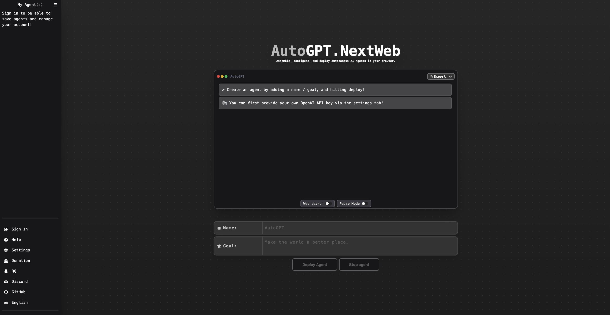

<div align="center">

<h1 align="center">AutoGPT-Next-Web</h1>

[English](https://github.com/Dogtiti/AutoGPT-Next-Web/blob/main/README.md) / [简体中文](https://github.com/Dogtiti/AutoGPT-Next-Web/blob/main/docs/README_CN.md) / 日本語

デザイン性の高い AutoGPT-Next-Web の Web UI を Vercel 上にワンクリックで展開できます。

一键免费部署你的私人 AutoGPT-Next-Web 网页应用。

[デモ](https://auto-agentgpt.com/) / [Issues](https://github.com/Dogtiti/AutoGPT-Next-Web/issues) / [Discord に参加](https://discord.gg/Xnsbhg6Uvd) / [コーヒーを買う](https://www.buymeacoffee.com/elricliu)

[演示](https://auto-agentgpt.com/) / [反馈](https://github.com/Dogtiti/AutoGPT-Next-Web/issues) / [QQ群](https://github.com/Dogtiti/AutoGPT-Next-Web/assets/38354472/562fabbb-76cd-4902-bb07-9ec7d82871fc
) / [微信](https://user-images.githubusercontent.com/38354472/232797309-9348f3a6-1dd7-422a-ad01-935247b1970e.png) / [打赏开发者](https://user-images.githubusercontent.com/38354472/232796654-c749602b-c1d4-402b-8c31-e7c013b7a42d.png)

[](https://vercel.com/new/clone?repository-url=https%3A%2F%2Fgithub.com%2FDogtiti%2FAutoGPT-Next-Web&env=OPENAI_API_KEY&project-name=autogpt-next-web&repository-name=AutoGPT-Next-Web)



</div>

## 私たちと話し合う


## 特徴

1. Vercel を使ったワンクリックの無料デプロイメントが 1 分で完了
2. 現地での対応力を向上させました： 中国語で入力すると、英語ではなく中国語で内容が表示
3. AgentGPT に合わせた UI 設計、レスポンシブデザイン、ダークモードへの対応
4. 独自ドメインをお持ちですか？バインド後、障壁なくどこでもすぐにアクセスできるのがさらに良い
5. アクセスコード制御をサポートし、本人または信頼できる個人のみがウェブサイトを使用可能

## ロードマップ

- [x] 1. Docker および Docker Compose のサポート追加
- [x] 2. エンドポイント URL のサポート追加
- [x] 3. Azure OpenAI API のサポートを追加
- [ ] 4. 実行結果の表示を最適化し、見やすくする
- [ ] 5. WeChat のログインに対応

## ビジネスバージョン

オープンソースプロジェクトを維持する期間中、多くの友人がシステムのカスタマイズについて相談に来ました。類似のニーズを持つ友人がより多くいる可能性があることを考慮して、商用版の内部テスト計画を開始することにしました〜

- 計画サポート -
  ユーザーログインシステム、請求システム、課金システムなどをサポートし、誰でも直接有料版の AutoGPT を展開し、収入を直接獲得することができます。
- 参加方法 -
  商業版を事前予約し、商業版計画の詳細を見るには、以下のリンク[AutoGPT-Next-Web ビジネスビジョン](https://egqz2y6eul.feishu.cn/docx/PxoMd7LGfoobAixiuWacxRWQnNd)。

## はじめに

[クリックすると詳細なチュートリアルが表示されます](https://autogpt-next-web.gitbook.io/autogpt-next-web/)

1. OpenAI API Key を用意する；
2. デプロイボタンをクリックし、プロンプトに従います
3. アクセスコントロール機能をサポートしています。詳細なチュートリアルは、上記のチュートリアルを参照してください

## FAQ

Q: このプロジェクトと AgentGPT の違いは何ですか？

A: AgentGPT から派生したプロジェクトです。私たちの目標は、国内のユーザーにとって使いやすい機能、インターフェース、様々なデプロイメントソリューションを継続的に提供し、誰もが簡単に自分だけの「AutoGPT」サイトを構築できるようにすることです。また、AgentGPT プロジェクトの国際化能力、Vercel 展開能力も、私たちの貢献から生まれたものです。

## Docker デプロイ

### Docker セットアップ

AutoGPT-Next-Web をローカルで実行する最も簡単な方法は、docker を使用することです。
便利なセットアップスクリプトが提供されているので、ぜひお試しください。

```bash
docker-compose -f docker-compose.dev.yml up -d --remove-orphans
```

### Docker-Image

`docker-image` デプロイを使用

```bash
docker-compose  -f docker-compose.prod.yml up -d --remove-orphans
```

### ローカル開発セットアップ

AutoGPT-Next-Web をローカルで開発したい場合、最も簡単な方法は次の通りです
付属のセットアップスクリプトを使用してください。

```bash
./setup.sh --local
```

### マニュアルセットアップ

> [Nodejs +18 (LTS 推奨)](https://nodejs.org/en/)がインストールされている必要があります。

1. このプロジェクトをフォーク:

- [こちらをクリック](https://github.com/Dogtiti/AutoGPT-Next-Web/fork).

2. リポジトリのクローン:

```bash
git clone git@github.com:YOU_USER/AutoGPT-Next-Web.git
```

3. 依存関係のインストール:

```bash
cd AutoGPT-Next-Web
npm install
```

4. 以下の内容で **.env** ファイルを作成:

> 環境変数は、以下の [schema](https://github.com/Dogtiti/AutoGPT-Next-Web/blob/main/src/env/schema.mjs) に一致する必要があります。

```bash
# デプロイ環境:
NODE_ENV=development

# 次の Auth 設定:
# `openenssl rand -base64 32`でシークレットを生成するか、https://generate-secret.vercel.app/ を参照してください
NEXTAUTH_SECRET=''
NEXTAUTH_URL=http://localhost:3000
DATABASE_URL=file:./db.sqlite

# あなたの open api key
OPENAI_API_KEY=''
```

5. sqlite を使用するために prisma スキーマを変更:

```bash
./prisma/useSqlite.sh
```

**注:** これは、sqlite を使用する場合にのみ必要な作業です。

6. 準備完了、実行:

```bash
# データベースのマイグレーションを作成
npx prisma db push
npm run dev
```

## Connect-AI More

| <div style="width:200px">AI</div> |              SDK               |                         Application                          |
| :-------------------------------: | :----------------------------------------------------------: | :----------------------------------------------------------: |
|              🎒OpenAI              |    [Go-OpenAI](https://github.com/ConnectAI-E/Go-OpenAI)     | [🏅Feishu-OpenAI](https://github.com/ConnectAI-E/Feishu-OpenAI), [🎖Lark-OpenAI](https://github.com/ConnectAI-E/Lark-OpenAI), [Feishu-EX-ChatGPT](https://github.com/ConnectAI-E/Feishu-EX-ChatGPT), [🎖Feishu-OpenAI-Stream-Chatbot](https://github.com/ConnectAI-E/Feishu-OpenAI-Stream-Chatbot), [Feishu-TLDR](https://github.com/ConnectAI-E/Feishu-TLDR),[Feishu-OpenAI-Amazing](https://github.com/ConnectAI-E/Feishu-OpenAI-Amazing), [Feishu-Oral-Friend](https://github.com/ConnectAI-E/Feishu-Oral-Friend), [Feishu-OpenAI-Base-Helper](https://github.com/ConnectAI-E/Feishu-OpenAI-Base-Helper), [Feishu-Vector-Knowledge-Management](https://github.com/ConnectAI-E/Feishu-Vector-Knowledge-Management), [Feishu-OpenAI-PDF-Helper](https://github.com/ConnectAI-E/Feishu-OpenAI-PDF-Helper), [🏅Dingtalk-OpenAI](https://github.com/ConnectAI-E/Dingtalk-OpenAI), [Wework-OpenAI](https://github.com/ConnectAI-E/Wework-OpenAI), [WeWork-OpenAI-Node](https://github.com/ConnectAI-E/WeWork-OpenAI-Node), [llmplugin](https://github.com/ConnectAI-E/llmplugin) |
|             🤖 AutoGPT             |                            ------                            | [🏅AutoGPT-Next-Web](https://github.com/ConnectAI-E/AutoGPT-Next-Web) |
|         🎭 Stablediffusion         |                            ------                            | [🎖Feishu-Stablediffusion](https://github.com/ConnectAI-E/Feishu-Stablediffusion) |
|           🍎 Midjourney            | [Go-Midjourney](https://github.com/ConnectAI-E/Feishu-Midjourney/tree/main/midjourney) | [🏅Feishu-Midjourney](https://github.com/ConnectAI-E/Feishu-Midjourney), [MidJourney-Web](https://github.com/ConnectAI-E/MidJourney-Web), [Dingtalk-Midjourney](https://github.com/ConnectAI-E/Dingtalk-Midjourney) |
|            🍍 文心一言             |    [Go-Wenxin](https://github.com/ConnectAI-E/Go-Wenxin)     | [Feishu-Wenxin](https://github.com/ConnectAI-E/Feishu-Wenxin), [Dingtalk-Wenxin](https://github.com/ConnectAI-E/Dingtalk-Wenxin), [Wework-Wenxin](https://github.com/ConnectAI-E/Wework-Wenxin) |
|             💸 Minimax             |   [Go-Minimax](https://github.com/ConnectAI-E/Go-Minimax)    | [Feishu-Minimax](https://github.com/ConnectAI-E/Feishu-Minimax), [Dingtalk-Minimax](https://github.com/ConnectAI-E/Dingtalk-Minimax), [Wework-Minimax](https://github.com/ConnectAI-E/Wework-Minimax) |
|             ⛳️ CLAUDE              |    [Go-Claude](https://github.com/ConnectAI-E/Go-Claude)     | [Feishu-Claude](https://github.com/ConnectAI-E/Feishu-Claude), [DingTalk-Claude](https://github.com/ConnectAI-E/DingTalk-Claude), [Wework-Claude](https://github.com/ConnectAI-E/Wework-Claude) |
|              🥁 PaLM               |      [Go-PaLM](https://github.com/ConnectAI-E/go-PaLM)       | [Feishu-PaLM](https://github.com/ConnectAI-E/Feishu-PaLM),[DingTalk-PaLM](https://github.com/ConnectAI-E/DingTalk-PaLM),[Wework-PaLM](https://github.com/ConnectAI-E/Wework-PaLM) |
|             🎡 Prompt              |                                                              | [📖 Prompt-Engineering-Tutior](https://github.com/ConnectAI-E/Prompt-Engineering-Tutior) |
|             🍋 ChatGLM             |                                                              | [Feishu-ChatGLM](https://github.com/ConnectAI-E/Feishu-ChatGLM) |
|            ⛓ LangChain            |                                                              | [📖 LangChain-Tutior](https://github.com/ConnectAI-E/LangChain-Tutior) |
